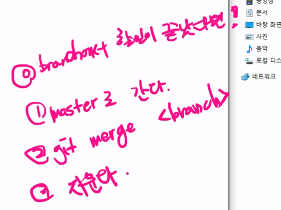

# TIL (Today I Learn)

## :calendar: 6/3

## git

### git 이 들어갈 디렉토리와 파일 만들기

먼저 git bash를 열면 `~` 로 끝나는 위치를 만나게 된다. 

이것은 현 위치가 홈파일 `C:/User/i` 을 가르킨다.

여기서 파일을 만들면 안되기 때문에 

`mkdir git_practice` 를 입력하여 새로운 디렉토리를 만들고,

`cd git_practice`를 입력하여 해당 디렉토리로 이동한다. :open_file_folder:

## :triangular_flag_on_post:git init

방금 만든 디렉토리에서 작업을 하기 위하여 

`git init`를 입력하여 작업장을 지정한다. 

`touch` 를 사용하여 파일을 하나 만들어 준다. 

오늘은 처음이니 오늘 날짜로 파일을 만들어준다.  :file_folder:

`touch 20210603.md` :calendar:

###  git status

파일을 만들면 `git status` 입력해본다. 

붉은 글씨와 함께  `git add`를 하라고 한다.  

아직 내용을 덜 썻으니 다 쓰고 해보자

## git add

`git add` 는 수정 혹은 작성을 마치고 준비가 다 된 파일을 올려주는 것이다.

`get add 20210603`

## :stadium: git commit

`git add` 이후에 이제 이 부분을 기록해 놀 차례이다.

`git commit -m '첫날!'`

이러면 완성!

### git log

이제 로그를 통해서 내가 만들 것을 확인해보자

## :calendar: 6/4

## 개요

## 오늘 배운 내용

`git branch <name>`

개발용 가지 만들기

`git switch  <name>`

개발용 가지로 변경

`git merge <name>`

개발 이후 합치기

`git branch -d <name>`

합친 이후 가지치기

### 순서 생각해 보기

1. `touch .gitignore` 
2. `touch READEME.md`
3. `git init`
4. `git add .`
5. `git commit -m 'masage'`
6. 그리고 이제 Remote로 가자

### Remote

Local => Remote

1. 리모트 생성 
2. 경로지정 (구분을 위해서 이름을 지정해야한다. )
   1. `git remote add <name> address`
   2. `git remote add origin https://github.com/ujaei21/first_remote_repo.git`
3. 업로드
   1.  `git push origin master` 
   2. 오리진의 마스터를 올리세요! 라는 의미
4. 커밋은 의미있는 경우만 
5. 수정후 푸시하면 수정된 것만 올라간다.